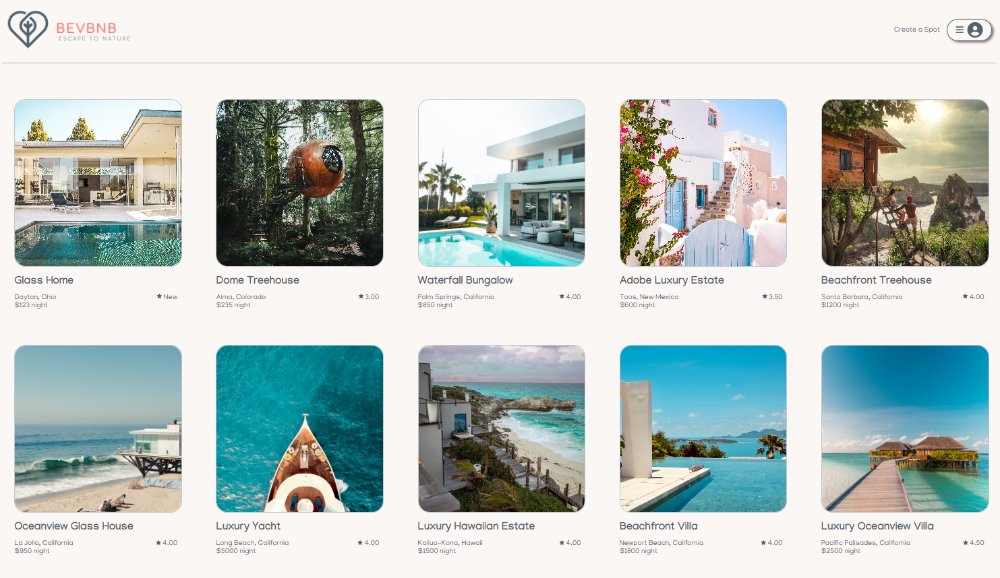
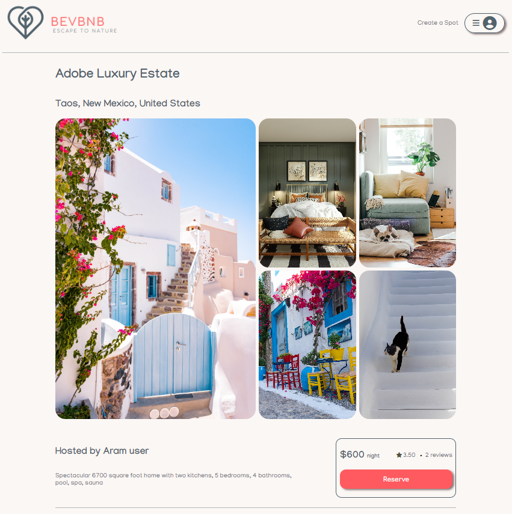

<!--!!START SILENT -->
# BevBnB

## Table of Contents
-[BevBnB](#bevbnb)
  -[Table of Contents](#table-of-contents)
  -[About](#about)
  -[Technologies](#technologies)
  -[Frontend](#frontend)
  -[Features](#features)
  -[Database Schema](#database-schema-design)
  -[Contact](#contact)

## About
BevBnB is an application for booking some very unique spots in the United States, that centers on bringing people back to nature and away from the hustle and bustle of busy city lives. My site is live on https://bevbnb.onrender.com

## Technologies
React/Redux CSS

Leveraging React, I create a dynamic and responsive user interface that adapts to your needs. Through Redux, I efficiently manage the application's state, ensuring a smooth flow of information. Additionally, CSS allows me to apply custom styles and layout elements, elevating the visual appeal of the website.
<!--!!END -->
<!--!!ADD -->
<!-- # `<name of application here>` -->
<!--!!END_ADD -->

## Frontend

### List of Spots

### Spot Information

## Features
- Logged in users can perform the following actions:
  - Create, view, update and delete spots
  - Create, view, update and delete reviews

## Database Schema Design

<!--!!START SILENT -->
![airbnb-database-schema]

[airbnb-database-schema]: https://appacademy-open-assets.s3.us-west-1.amazonaws.com/Modular-Curriculum/content/week-12/airbnb-db-schema.png
[airbnb-db-diagram-info]: https://appacademy-open-assets.s3.us-west-1.amazonaws.com/Modular-Curriculum/content/week-12/airbnb-db-diagram-info.txt
<!--!!END -->
<!--!!ADD -->
<!-- `<insert database schema design here>` -->
<!--!!END_ADD -->

## API Documentation
-[API Documentation](./API.md)

## Contact

* Beverly Duran:
    * LinkedIn: https://www.linkedin.com/in/beverly-duran/
    * GitHub: https://github.com/duranbeverly
